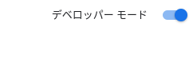
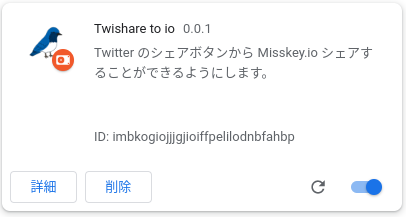

# Twishare to io v0.0.1  
## 概要
[Twitter](https://twitter.com/) のシェアボタンから [Misskey.io](https://misskey.io/) にシェアできるようになる Chrome拡張 です。  

## インストール
1. [リポジトリページ](https://github.com/alpaca-honke/twishare-to-io/)の右上の```<>Code```ボタンを押し、Localタブの一番下、「Download Zip」を押して、ファイルをダウンロード  
1. ダウンロードしたファイルを適当な場所に展開  
1. Chrome や互換ブラウザを開く  
1. [拡張機能の設定画面](chrome://extensions/)を開いて、右上の「デベロッパーモード」をオンにする  

1. 右上の「パッケージ化されていない拡張機能を読み込む」を押して、先程ファイルを展開したフォルダを選択  


## 使い方
Twitter シェアボタンを押して、ページ遷移する際に、Misskey.io にシェアするか聞かれますので、 OK を押すと、 Misskey.io にシェアされます。  


## アップデート方法
拡張機能の設定画面から、以下の拡張機能を探して、記載されているバージョン番号と「0.0.1」があっているかを確認してください。  
  
あっていない場合、再度インストール手順の 3 番まで行っていただき（このとき、展開する場所は前回と同じにしてください。）、拡張機能の管理画面から、Twishare to io の右下の更新ボタンを押して更新してください。  
展開する場所が異なる場合は、拡張機能を削除してから再度インストールを行ってください。  
