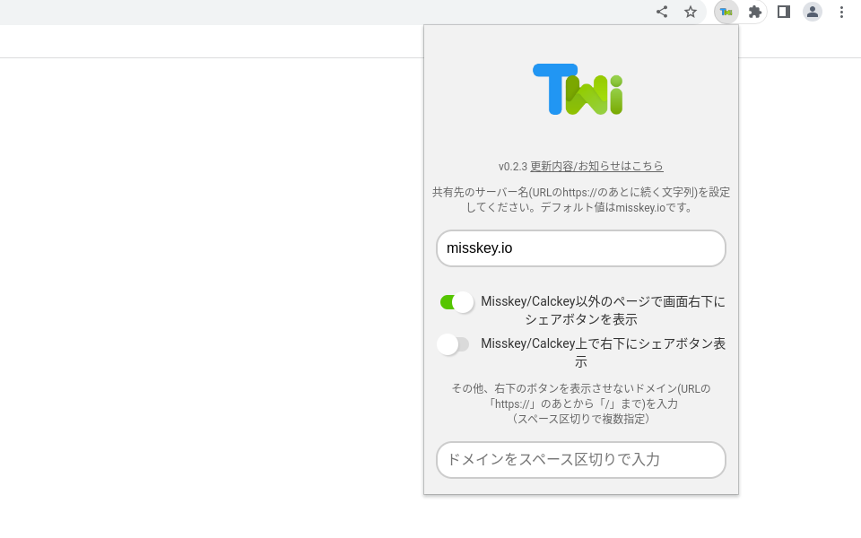
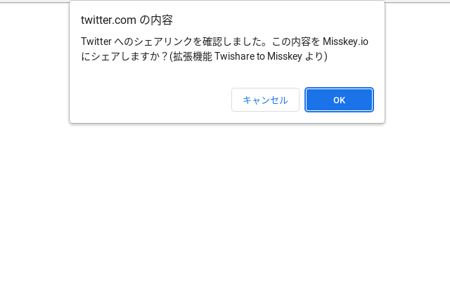
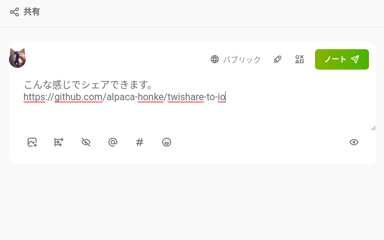

# Twishare to Misskey v0.2.1  

## 概要

[Twitter](https://twitter.com/) のシェアボタンから Misskey （またはその派生 SNS）にシェアできるようになる Chrome拡張 です。  
気分で更新します。  

## インストール

### Chrome 互換ブラウザ

（Chrome, Chromium, Edge, Vivaldi, Brave など）  
Android スマートフォンでは Kiwi Browser などで使用ができます。  

[Chrome ウェブストア](https://chrome.google.com/webstore/detail/twishare-to-misskey/fbaifpppndnlbbjcbjdfgbdkoibnipjb)にアクセスしてインストールしてください。  

### Firefox 互換ブラウザ  

（Firefox など）  

[Firefox Addons](https://addons.firefox.org/ja/firefox/addon/twishare-to-misskey/)からインストールしてください。  

## 使い方

1. 左上の拡張機能の一覧から、Twishare to Misskey のアイコンをクリックすると、シェア先のサーバーを保存する画面がひらくので、入力・保存してください。
（Misskey.io にシェアする場合と二回目以降は不要です。）  
また、その下のトグルスイッチも選択して保存してください。  

1. Twitter シェアボタンを押して、ページ遷移する際に、Misskey にシェアするか聞かれますので、 OK を押すと、 Misskey にシェアされます。  

1. 最初にトグルスイッチにチェックを入れた場合は、画面の右下に緑のシェアボタンが出てきます。これを使えば、Twitterのシェアボタンがないページもシェアできます。  

## よくある質問

[Wiki ページ](https://github.com/alpaca-honke/twishare-to-misskey/wiki/よくある質問)をご覧ください。  

## 連絡先

要望・バグ報告などは、あるかっぱ/アルパカ本家まで気軽にお願いします。  
（GitHub の issue でもいいですが、質問は issue には投稿しないでください。）

- [Misskey.io (@alpaca_honke@misskey.io)](https://misskey.io/@alpaca_honke)
- [もこきー (@alpaca_honke@mkkey.net)](https://mkkey.net/@alpaca_honke)
- [Twitter (@alpaca_honke)](https://twitter.com/alpaca_honke)
- [GoogleForms （Eメールでのやり取りをご希望の方はこちら）](https://docs.google.com/forms/d/e/1FAIpQLSdRuzAmGEqDV4RRd-70JKXD0lAHE6xjEp8Qp5-Jfut-ysQMYQ/viewform)
- [その他](https://alpaca-honke.github.io/)

Misskey.io の Discord にもいるとかいないとか。（いるんで見つけたらそこから連絡していただいても構いません）  

## Contribution

問題の修正、新機能の追加など、開発に協力してくださる方がいましたら大歓迎です。[CONTRIBUTING.md](CONTRIBUTING.md)をご覧ください。  

## Contributors

- [@emtkmkk](https://github.com/emtkmkk)さん
- [@massongit](https://github.com/massongit)さん

## License

この拡張機能は、 MIT ライセンスで頒布されています。詳しくは、[LICENSE](LICENSE) をご覧ください。  
