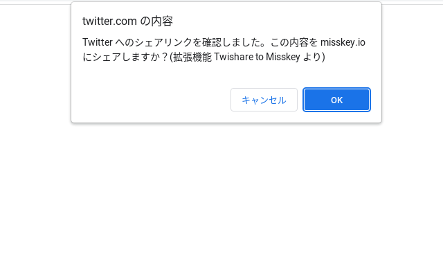

# Twishare to Misskey

    

    )  

**この文書の[日本語版](README.md)もあります。**

## Overview

This is a Chrome extension that allows you to share to Misskey (or its derivatives) from the Twitter share button.  
I'll update it as I feel like it.  

- [Official site](https://alpaca-honke.github.io/twishare-to-misskey)  
- [Repository](https://github.com/alpaca-honke/twishare-to-misskey)  
- [Chrome Web Store](https://chrome.google.com/webstore/detail/twishare-to-misskey/fbaifpppndnlbbjcbjdfgbdkoibnipjb)
- [Firefox Addons](https://addons.mozilla.org/ja/firefox/addon/twishare-to-misskey/)

## Features

- When you click the share button for Twitter, a confirmation screen appears and you can choose whether you want to share to Misskey (not Twitter) or not.
    - Of course, you can also share to Twitter if you cancel.
    - It will be hidden when there are some full-screend something such as videos.
- If there's no Twitter share button, you can still share to Misskey by clicking the share button in the lower right corner.
    - Can be moved and moved out of the way
    - You can hide it.
- There is a share button in the extension popup (only for Chrome)
- Almost all Misskey (v12 or later) and Firefish (formerly Calckey) are supported
- When sharing a tweet, the content of the tweet can be pasted as a quote in the note
- Remove unnecessary information attached to URLs on certain sites before sharing
    - YouTube: remove IDs that may be involved in tracking
    - Twitter: Remove numbers assigned when generating share links that may indicate the type of device.
- Secure because it does not store authentication information
- Distribute bookmarklets that have the same functionality as some of the extensions

## Installation

### Chrome Compatible Browsers

(Chrome, Chromium, Edge, Vivaldi, Brave, Opera, etc.)  
Android smartphones can use Kiwi Browser, etc.  

Please visit [Chrome Web Store](https://chrome.google.com/webstore/detail/twishare-to-misskey/fbaifpppndnlbbjcbjdfgbdkoibnipjb) to install.  

### Firefox Compatible Browsers  

(Firefox etc.)  

Go to [Firefox Addons](https://addons.mozilla.org/ja/firefox/addon/twishare-to-misskey/) and install.  

### Safari

Not published for Safari, but it might work... (I don't know because I don't have Apple products)  
(Safari seems to be `browser.storage.sync` unsupported, so this extension using it may not work)  
Get the source code from [release page](https://github.com/alpaca-honke/twishare-to-misskey/releases) and put manifest.json under the chrome directory in the repository root, Please give it a good try.

[Twishare to Misskey Bookamrklet](https://alpaca-honke.github.io/twishare-to-misskey/bookmarklet.html) distributes a bookmarklet that provides the functionality of the Twishare to Misskey share button. Please use this bookmarklet.

Also, [@wareplus@nijimiss.moe](https://nijimiss.moe/@wareplus), a member of nijimiss.moe, provides a Safari shortcut for a similar purpose! ↓ ...  
[Shortcuts, CSS, etc. that I created](https://nijimiss.moe/@wareplus/pages/made_by_wareplus)

Also, if there are people who can create extensions for Safari so that we can properly support Safari, I would appreciate it if you could help us!
(I'm sure I can do it if I try hard enough, but I can't confirm that it works...)

### Others

Please download signed packages and other information from the [release page](https://github.com/alpaca-honke/twishare-to-misskey/releases).

Although not official, there seems to be an unofficial UserScript. (This is an older version. If you have any questions about this, please contact the UserScript publisher.)
[UserScript](https://greasyfork.org/ja/scripts/466136-twishare-to-misskey)

[Twishare to Misskey Bookamrklet](https://alpaca-honke.github.io/twishare-to-misskey/bookmarklet.html) is distributing a bookmarklet that provides the functionality of the Twishare to Misskey share button. Please use the bookmarklet that provides the function of Twishare to Misskey's share button.

## How to use

1. after installation, go to the extension's administration screen and check if various permissions are allowed, and grant them as appropriate.  
1. click the Twishare to Misskey icon in the list of extensions on the top left, and enter the server name you want to share to.
(This is not necessary if you are sharing to Misskey.io or second time share and after.)  
Also, select the toggle switch below it.  

1. when you press the Twitter share button and go to the next page, you will be asked if you want to share to Misskey.  
Click OK to share the page to Misskey. 

1. if you checked the toggle switch first, a green share button will appear in the lower right corner of the screen. This allows you to share pages that do not have a Twitter share button.  
    

## Have a question?

Please take a look at the [Wiki page](https://github.com/alpaca-honke/twishare-to-misskey/wiki/よくある質問) first. If you still don't understand, please contact us at.  

## Contact

If you have any requests, bug reports, etc., **please feel free** (this is important) to contact Alkappa/alpaca-honke.  

- [Mkkey (@alpaca_honke@mkkey.net)](https://mkkey.net/@alpaca_honke)
- [Misskey.io (@alpaca_honke@misskey.io)](https://misskey.io/@alpaca_honke)
- Discord @alpaca_honke
- [Twitter (@alpaca_honke)](https://twitter.com/alpaca_honke)
- [Email (akp@ymail.ne.jp)](mailto:akp@ymail.ne.jp)
- [More](https://alpaca-honke.github.io/)

## Update History

See [the page you see when it is updated](https://alpaca-honke.github.io/twishare-to-misskey/installed.html)

## Contribution

We welcome anyone who would like to help us with development, such as fixing problems, adding new features, etc. Please see [CONTRIBUTING.md](https://github.com/alpaca-honke/twishare-to-misskey/blob/develop/docs/CONTRIBUTING.md).  

## Contributors

- [@emtkmkk](https://github.com/emtkmkk)
- [@massongit](https://github.com/massongit)
- [@rinjugatla](https://github.com/rinjugatla)

## Similar Services

Mirai Corporation Co., Ltd. has released a share button for Misskey to be installed on your website! If you have your own website or blog, please use it!  
[Misskey Share](https://misskeyshare.link)

I have also created a service that makes it easy to create a URL to share using Misskey Share. Please check it out too!  
[Misskey Share URL Creator Tool](https://alpaca-honke.github.io/make-misskeyshare-url)

The Misskey development team has also officially released a share button to be placed on your website!  
[Misskey Hub 共有フォーム中継サービス](https://misskey-hub.net/en/docs/for-users/features/share-form/#misskey-hub%E3%81%AE%E5%85%B1%E6%9C%89%E3%83%95%E3%82%A9%E3%83%BC%E3%83%A0%E4%B8%AD%E7%B6%99%E3%82%B5%E3%83%BC%E3%83%93%E3%82%B9%E3%81%AB%E3%81%A4%E3%81%84%E3%81%A6)

## About Logo/ images

The Twishare to Misskey logo (first image below) and the share button image (second image below) were created by modifying images published at [misskey-dev/assets](https://github.com/misskey-devhttps://raw. githubusercontent.com/alpaca-honke/twishare-to-misskey/develop/assets). 
You are free to use it under the CC BY-NC-SA 4.0 license.   
  

## License

This extension is distributed under the MIT License. See [LICENSE](https://github.com/alpaca-honke/twishare-to-misskey/blob/develop/LICENSE) for more information.  

Copyright © 2023-2024 あるかっぱ/アルパカ本家 Alkappa/alpaca-honke, and other contributors
