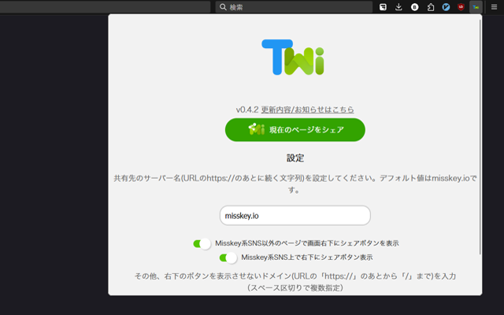
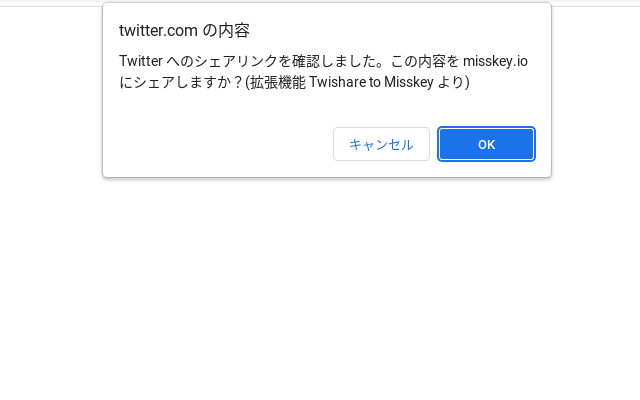
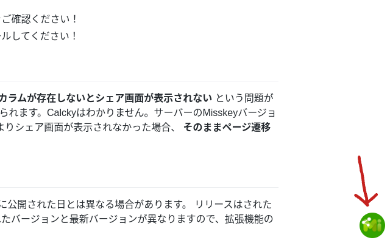

# Twishare to Misskey v0.2.5  

    

     
## 概要

Twitterのシェアボタンから Misskey （またはその派生 SNS）にシェアできるようになる Chrome拡張 です。  
気分で更新します。  

## 特徴

- Twitterのシェアボタンを押したときに確認画面が出てきてMisskeyにシェアできるか選択できる
- もちろんキャンセルすればTwitterにもシェアできる
- Twitterシェアボタンがなくても右下に出るシェアボタンからMisskeyにシェアできる
- ほぼすべてのMisskey（v12以降）とFirefish（旧Calckey）に対応
- ツイートをシェアする際に、ツイート内容がノートに引用として貼り付けられる
- 認証情報を保存しないためセキュリティ的に安全

## インストール

### Chrome 互換ブラウザ

（Chrome, Chromium, Edge, Vivaldi, Brave, Opera など）  
Android スマートフォンでは Kiwi Browser などで使用ができます。  

[Chrome ウェブストア](https://chrome.google.com/webstore/detail/twishare-to-misskey/fbaifpppndnlbbjcbjdfgbdkoibnipjb)にアクセスしてインストールしてください。  

### Firefox 互換ブラウザ  

（Firefox など）  

[Firefox Addons](https://addons.mozilla.org/ja/firefox/addon/twishare-to-misskey/)からインストールしてください。  

### Safari

Safari向けには公開していませんが、動くかもしれない...。（Apple製品を持ってないからわかんない）  
（Safariは`browser.storage.sync`非対応らしいので、これを使っているこの拡張は動かないかも）  
[リリースページ](https://github.com/alpaca-honke/twishare-to-misskey/releases)からソースコードを取得して、chromeディレクトリ配下のmanifest.jsonをリポジトリルートにおいて、よしなにやってあげてください。

また、にじみす鯖の方（[@wareplus@nijimiss.moe](https://nijimiss.moe/@wareplus)さん）が似た用途のSafariショートカットを公開してくれているようなのでぜひご利用ください！↓  
[作成したショートカットとかCSSとかとか](https://nijimiss.moe/@wareplus/pages/made_by_wareplus)

あと、ちゃんとSafariに対応させられるように、Safari向け拡張機能作れる環境ある方いたら手伝ってくれたら嬉しいです！
（がんばればできないこともなさそうだけど、動作確認が取れないので...。）

### その他

署名済みパッケージなどは[リリースページ](https://github.com/alpaca-honke/twishare-to-misskey/releases)からダウンロードしてください。

公式ではありませんが、非公式でUserScriptがあるようです。（旧バージョンです。これに関するお問い合わせはUserScript公開者さんにお願いします。）
[UserScript](https://greasyfork.org/js/scripts/466136-twishare-to-misskey)

## 使い方

1. インストールしたら、[拡張機能の管理画面](about:extensions)から、各種権限が許可されているか確認して、適宜許可してください。  
1. 左上の拡張機能の一覧から、Twishare to Misskey のアイコンをクリックすると、シェア先のサーバーを保存する画面がひらくので、入力してください。
（Misskey.io にシェアする場合と二回目以降は不要です。）  
また、その下のトグルスイッチも選択してください。  

1. Twitter シェアボタンを押して、ページ遷移する際に、Misskey にシェアするか聞かれますので、 OK を押すと、 Misskey にシェアされます。  

1. 最初にトグルスイッチにチェックを入れた場合は、画面の右下に緑のシェアボタンが出てきます。これを使えば、Twitterのシェアボタンがないページもシェアできます。  
    

## 質問がある？

まずは[Wiki ページ](https://github.com/alpaca-honke/twishare-to-misskey/wiki/よくある質問)を見てみてください。それでもわからなければ以下の連絡先にご連絡ください。  

## 連絡先

要望・バグ報告などは、あるかっぱ/アルパカ本家まで **気軽に** （ココ重要）お願いします。  

- [もこきー (@alpaca_honke@mkkey.net)](https://mkkey.net/@alpaca_honke)
- [Misskey.io (@alpaca_honke@misskey.io)](https://misskey.io/@alpaca_honke)
- [ぼすきー @alpaca_honke@voskey.icalo.net](https://voskey.icalo.net/@alpaca_honke)
- [のえすきー (@alpaca_honke@misskey.noellabo.jp)](https://misskey.noellabo.jp/@alpaca_honke)
- [Twitter (@alpaca_honke)](https://twitter.com/alpaca_honke)
- [GoogleForms （Eメールでのやり取りをご希望の方はこちら）](https://docs.google.com/forms/d/e/1FAIpQLSdRuzAmGEqDV4RRd-70JKXD0lAHE6xjEp8Qp5-Jfut-ysQMYQ/viewform)
- [その他](https://alpaca-honke.github.io/)

Misskey.io の Discord にもいるとかいないとか。（いるんで見つけたらそこから連絡していただいても構いません）  

## 更新履歴

[更新されたときに見るページ](https://alpaca-honke.github.io/twishare-to-misskey/installed.html)みてね

## Contribution

問題の修正、新機能の追加など、開発に協力してくださる方がいましたら大歓迎です。[CONTRIBUTING.md](https://github.io/alpaca-honke/twishare-to-misskey/blob/develop/docs/CONTRIBUTING.md)をご覧ください。  

## Contributors

- [@emtkmkk](https://github.com/emtkmkk)さん
- [@massongit](https://github.com/massongit)さん
- [@rinjugatla](https://github.com/rinjugatla)さん

## 類似サービス

未来情報産業㈱さんから、ウェブサイトに設置するMisskey向けシェアボタンが出ています！ご自身のウェブサイトとかブログある方は是非ご利用ください！  
[Misskey Share](https://misskeyshare.link)

また、僕はこのMisskey Shareを使用してシェアするためのURLを簡単に作成するサービスも作成しました。こちらもぜひ！  
[Misskey Share URL 作成簡単ツール](https://alpaca-honke.github.io/make-misskeyshare-url)

## ロゴ・画像について

Twishare to Misskeyのロゴ（以下画像1枚目）と、シェアボタンの画像（以下画像2枚目）は、[misskey-dev/assets](https://github.com/misskey-devhttps://raw.githubusercontent.com/alpaca-honke/twishare-to-misskey/develop/assets)で公開されている画像に変更を加えたものです。  
CC BY-NC-SAライセンス
のもとで自由に使用していただけます。  
  

## License

この拡張機能は、 MIT ライセンスで頒布されています。詳しくは、[LICENSE](LICENSE) をご覧ください。  

Copyright © あるかっぱ/アルパカ本家 Alkappa/alpaca-honke, and other contributors
